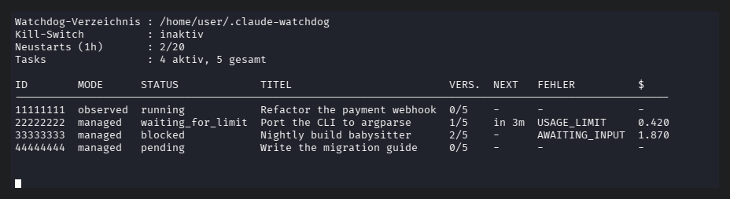

# Claude Watchdog

[](https://github.com/JBGfr/claude-watchdog/actions/workflows/tests.yml)

A supervisor daemon for Claude Code sessions. It watches work that is already
running, recognises why it stopped — usage limit, rate limit, API or network
error, crash, stall, context limit, or a question waiting for an answer — and
resumes what it is allowed to resume, as soon as that is possible again.

No tmux, no keystroke injection, no interference with your terminals. The
watchdog reads the transcripts Claude Code writes anyway
(`~/.claude/projects/<escaped-cwd>/<session-id>.jsonl`), asks
`claude agents --json` for session state, checks `/proc` for the process, and
— only for tasks it started itself — launches a headless `claude -p` run.

German version of this document: [README.de.md](README.de.md).
Data flow, invariants and how to verify them: [SECURITY.md](SECURITY.md).



*The picture comes from demo mode (`CW_DEMO=1 claude-watchdog status`), which
replaces the task list with invented ones — the real one carries session titles
and project paths.*

## Two modes

| Mode | Where it comes from | What the watchdog may do |
|---|---|---|
| `managed` | started by the watchdog via `add` | everything: start, resume, restart fresh |
| `observed` | your own interactive session, picked up automatically or via `attach` | **observe and notify only** |

Running sessions are adopted **by themselves**: whatever `claude agents --json`
lists and has no task yet is recorded as `observed`. You do not have to think
about it when you start a long session and walk away. Turn it off with
`CW_AUTO_ATTACH=0`, restrict it with `CW_AUTO_ATTACH_DIRS`. Sessions that are
already recorded are skipped — including finished ones, otherwise a session
that just ended would immediately be adopted again.

Sessions that already run under a systemd unit of their own are skipped too
(default unit prefix `claude-session@`, see `CW_SKIP_SUPERVISED`). There systemd
restarts the process itself; a second supervisor would create a new task on
every scheduled restart and clear it away moments later. The check looks at the
process cgroup, not at a name.

**The safety invariant:** an `observed` session is never started, resumed or
restarted. This is enforced in exactly one place — `enforce_mode_guard()` in
`claude_watchdog/recovery.py`, anchored on `INTRUSIVE_ACTIONS` in
`claude_watchdog/models.py` — and covered by `tests/test_guard.py`. When an
observed session ends, its task is completed instead of being reported forever.

Second invariant: `AWAITING_INPUT` is reported, never answered. The watchdog
makes no decisions about content.

## Requirements

- Linux with a systemd user instance (`systemctl --user`)
- Python 3.11 or newer, standard library only — no pip, no third-party packages
  (developed and tested on 3.13; CI runs 3.13)
- Claude Code CLI at `~/.local/bin/claude`, or anywhere else with `CW_CLAUDE_BIN`
  pointing at it (a bare program name there is resolved through `PATH`)
- optional: `notify-send` for desktop notifications, `systemd-run` for the
  memory limit around started runs

## Installation

The repository can live anywhere; nothing assumes a particular parent
directory.

```sh
git clone https://github.com/JBGfr/claude-watchdog.git
cd claude-watchdog
./install.sh
```

`install.sh` only creates symlinks and reloads systemd. It deletes nothing,
overwrites nothing, and starts nothing:

- `bin/claude-watchdog` -> `~/.local/bin/claude-watchdog`
- `bin/backup-repo` -> `~/.local/bin/claude-watchdog-backup`
- `systemd/*.service`, `systemd/*.timer` -> `~/.config/systemd/user/`
- `systemctl --user daemon-reload`

Make sure `~/.local/bin` is on your `PATH` — the units call the CLI through
that path. Then switch the daemon on yourself:

```sh
systemctl --user enable --now claude-watchdog.service
systemctl --user status claude-watchdog.service
```

There is no package to install: `bin/claude-watchdog` is a `/bin/sh` wrapper
that puts the repository on `PYTHONPATH` and runs
`python -m claude_watchdog.cli`. It uses `.venv/bin/python` when a virtualenv
exists and `python3` otherwise.

The shipped unit assumes an X11 desktop session so that notifications arrive:
it sets `DISPLAY=:0` and `DBUS_SESSION_BUS_ADDRESS=unix:path=%t/bus`. On a
different display, on Wayland or on a headless machine, adjust those or drop
them and set `CW_NOTIFY=0`. Since the installed unit is a symlink into the
repository, prefer a drop-in over editing it:

```sh
systemctl --user edit claude-watchdog.service
```

With `sudo loginctl enable-linger $USER` the daemon also runs without a
logged-in session and from boot.

The second unit pair (`claude-watchdog-backup.service` / `.timer`) is optional
and off unless you enable the timer. It writes a dated `tar.gz` of the
repository directory to `~/backups` (`CW_BACKUP_DIR`).

## Usage

```sh
# create a managed task - the daemon starts it on its next pass
claude-watchdog add "Make the test suite green" --model sonnet --max-budget-usd 2

# record a running session by hand - only needed when auto-attach is off
# or the CLI does not list the session
claude-watchdog attach <session-id>

# overview
claude-watchdog status
claude-watchdog list --all
claude-watchdog logs <task-id> -n 60

# control
claude-watchdog pause <task-id>              # take out of supervision
claude-watchdog resume <task-id>             # put back in
claude-watchdog reply <task-id> "answer"     # answer a blocked managed task
claude-watchdog rm <task-id>                 # remove
```

Options worth knowing:

- `add`: `--cwd`, `--title`, `--model`, `--permission-mode`, `--max-attempts`,
  `--max-budget-usd`, `--no-auto-resume` (report only, never resume by itself)
- `attach`: `--cwd`, `--title`
- `list` / `status`: `--all` (include finished tasks), `--json`
- `logs`: `-n/--lines` (default 40)
- `resume`: `--reset-attempts`
- `reply` / `rm`: `--force`
- `run`: `--dry-run` (decide and log everything, execute nothing), `--quiet`,
  `--verbose` — `run` is what the systemd unit starts

`reply` provides the mechanism only: it appends a turn to the existing
transcript, holds the task for `CW_REPLY_GRACE` seconds so the stale tail is
not classified as a question again, and counts against the global restart
budget. The content of the answer comes from the caller. It is refused for
`observed` tasks. The watchdog itself still answers nothing.

A session ID is shown by `claude agents --json`; it is also the file name of
the transcript under `~/.claude/projects/<escaped-cwd>/<session-id>.jsonl`.

**Emergency stop:** while the file `$CW_BASE_DIR/STOP` (default
`~/.claude-watchdog/STOP`) exists, the watchdog starts nothing at all.
Processes already running are left alone.

```sh
touch ~/.claude-watchdog/STOP   # stop starting anything
rm ~/.claude-watchdog/STOP      # allow again
```

## How it decides

Every pass (15 s by default) each active task is observed, the situation is
classified, and exactly one action follows.

**Observation** combines four sources instead of trusting one: the process is
alive (`/proc`), the transcript is growing, `claude agents --json` knows the
session, and for managed tasks the run log and exit code as well.

**Classification** happens in two stages (`classifier.py`): first the
structured JSON fields (`rate_limit_info`, `result`, `isApiErrorMessage`), then
a central regex table over the raw text as a fallback. Within the first stage
the **most recent** signal wins — an old warning must not override a later
`result: success`.

| Class | Action |
|---|---|
| `NONE` (result: success) | `complete` |
| `USAGE_LIMIT` | `schedule` until the reset time; does **not** count as a failed attempt |
| `RATE_LIMIT` | `schedule` after `retry-after`, otherwise exponential backoff |
| `API_ERROR`, `NETWORK`, `CRASH`, `STALLED` | `resume` with exponential backoff |
| `CONTEXT` | `restart_fresh` — a new session carrying the original task text and an excerpt of the previous one, instead of a blind resume (see `CW_FRESH_DIGEST`) |
| `AWAITING_INPUT` | `notify` only — a question is **never** answered automatically |
| observed session gone | `complete` |

Limits, so that nothing runs away:

- `max_attempts` per task (default 5)
- at most 20 restarts per hour across all tasks
- anti-loop: three failures at the same transcript position mark the task `failed`
- session lock: the same task is never started twice
- usage and rate limits do not increase the attempt counter — running out of
  quota is not a failure of the task

An observed session counts as finished only when **all three** conditions hold:
no process any more, `claude agents --json` was reachable and does not know it,
and no transcript growth for `CW_OBSERVED_GONE_SECONDS`. If the CLI query is
broken, nothing is assumed.

Every decision is written to `watchdog.log` as one JSON line, so afterwards it
is possible to reconstruct why the watchdog did something.

## Configuration

Everything is an environment variable, no code change needed
(`claude_watchdog/config.py`). Boolean variables are off for `0`, `false` and
`no`, and on for anything else. For the daemon they belong in a drop-in
(`systemctl --user edit claude-watchdog.service`, then `Environment=CW_...=...`
under `[Service]`); the CLI picks them up from your shell.

| Variable | Default | Meaning |
|---|---|---|
| `CW_BASE_DIR` | `~/.claude-watchdog` | data directory: `state.db`, `watchdog.log`, `runs/`, `daemon.lock`, `STOP` |
| `CW_CLAUDE_BIN` | `~/.local/bin/claude` | path to the Claude Code CLI |
| `CW_PROJECTS_DIR` | `~/.claude/projects` | where Claude Code keeps its transcripts |
| `CW_AUTO_ATTACH` | `1` | adopt running sessions automatically as `observed` |
| `CW_AUTO_ATTACH_DIRS` | empty | only adopt sessions below these directories (comma separated); empty means everywhere |
| `CW_SKIP_SUPERVISED` | `1` | skip sessions that already run under a systemd unit of their own |
| `CW_SUPERVISED_UNIT_PREFIX` | `claude-session@` | unit prefix that counts as foreign supervision |
| `CW_POLL_INTERVAL` | `15` | seconds between two passes |
| `CW_STALL_SECONDS` | `900` | no progress for longer than this counts as stalled |
| `CW_OBSERVED_GONE_SECONDS` | `120` | how long an observed session must be gone before the observation is closed |
| `CW_REPLY_GRACE` | `180` | grace period after `reply` during which the daemon does not touch the task |
| `CW_AGENTS_CACHE_TTL` | `30` | cache lifetime for `claude agents --json` |
| `CW_AGENTS_TIMEOUT` | `20` | timeout for that call |
| `CW_BACKOFF_BASE` | `30` | first backoff wait in seconds |
| `CW_BACKOFF_FACTOR` | `2.0` | growth factor per attempt |
| `CW_BACKOFF_CAP` | `1800` | upper bound for the wait |
| `CW_BACKOFF_JITTER` | `0.2` | relative jitter on the wait |
| `CW_USAGE_LIMIT_FALLBACK_WAIT` | `3600` | wait when a usage limit carries no usable reset time |
| `CW_USAGE_LIMIT_RESET_PADDING` | `30` | padding added after a reset time |
| `CW_MAX_ATTEMPTS` | `5` | retries per task |
| `CW_MAX_RESTARTS_PER_HOUR` | `20` | global restart budget |
| `CW_MAX_SAME_MARKER_RETRIES` | `3` | anti-loop limit at one transcript position |
| `CW_TAIL_BYTES` | `65536` | how much of a log tail is read for classification |
| `CW_FRESH_DIGEST` | `1` | may a `restart_fresh` put a verbatim excerpt of the previous session into the new prompt? `0` substitutes a neutral note; the original task text is kept either way (see [SECURITY.md](SECURITY.md)) |
| `CW_RUN_LAUNCHER` | `scope` | how a managed run is started. `scope` is a child of the daemon; `service` lets the user manager start it as a transient service, which is what makes the daemon's own network isolation possible (see [SECURITY.md](SECURITY.md)) |
| `CW_RETENTION_DAYS` | `14` | grace period for finished tasks, `0` = never clean up |
| `CW_CLEANUP_INTERVAL` | `3600` | seconds between two cleanup passes |
| `CW_LOG_MAX_BYTES` | `5242880` | log rotation size |
| `CW_LOG_BACKUP_COUNT` | `5` | rotated log files kept |
| `CW_LOG_REPEAT_INTERVAL` | `1800` | seconds an unchanged decision stays quiet (`0` = log every pass) |
| `CW_NOTIFY` | `1` | desktop notifications |
| `CW_NOTIFY_BIN` | `notify-send` | notification program |
| `CW_NOTIFY_MAX_PER_HOUR` | `0` | hard ceiling for desktop notifications per sliding hour, the throttle notice included, `0` = no ceiling. The last slot of the hour carries a notice that further ones are log-only; the log always keeps everything |
| `CW_BACKUP_DIR` | `~/backups` | target directory of `bin/backup-repo` (that script only, not read by the daemon) |

## Layout

```
claude_watchdog/
  daemon.py      main loop, single-instance lock, adoption at startup
  detector.py    observation: alive / stalled / gone
  classifier.py  classification; ALL text patterns live in PATTERNS
  recovery.py    decide() decides, execute() acts, mode guard
  backoff.py     wait times and retry rules
  registry.py    SQLite state, locks, restart budget
  transcript.py  robust reading of growing JSON-Lines files
  notifier.py    notify-send
  config.py      paths and defaults
  cli.py         command line
```

Runtime data (not in the repository): `state.db`, `watchdog.log`,
`runs/<task-id>/` with one `attempt-NNN.jsonl` per run, `daemon.lock`.

## Tests

```sh
python3 -m unittest discover -s tests
```

280 tests, no third-party packages, no network, no sleeps, no real
subprocesses; the suite runs in well under a second. Covered are the
classification (including real event sequences from actual runs), the backoff
rules, the safety invariant that observed sessions are never touched, and the
invariant that the code contains no network client at all
(`tests/test_lokal.py`).

## Security and privacy

[SECURITY.md](SECURITY.md) documents what the watchdog reads, what it writes
and where, the exactly three programs it can start, the single path on which
data leaves the machine, and how to verify each of those claims yourself.

## Related

[claude-sessions](https://github.com/JBGfr/claude-sessions) is a companion
GTK3 application that shows running Claude Code sessions in a window. It is a
separate project and not required to run the watchdog.

## Known quirks

- A `done` task keeps its last error class in the overview. That is history,
  not current state.
- The watchdog never sets `permission_mode` by itself. Without one, a managed
  run asks before sensitive actions and is reported as `AWAITING_INPUT`.
- The watchdog answers no questions and makes no decisions about content. It
  only makes sure that work continues.

## License

MIT, see [LICENSE](LICENSE).

Not affiliated with Anthropic. Claude and Claude Code are products of
Anthropic; this is an independent tool.
